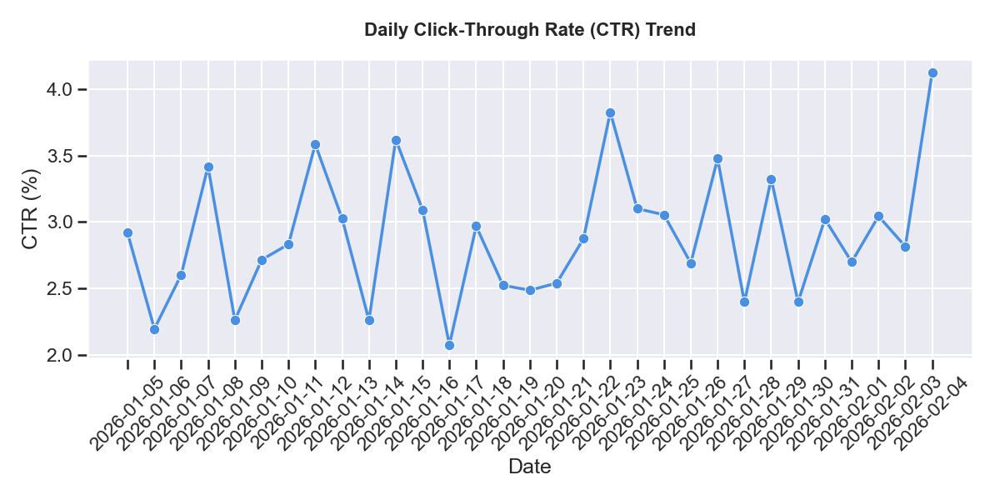
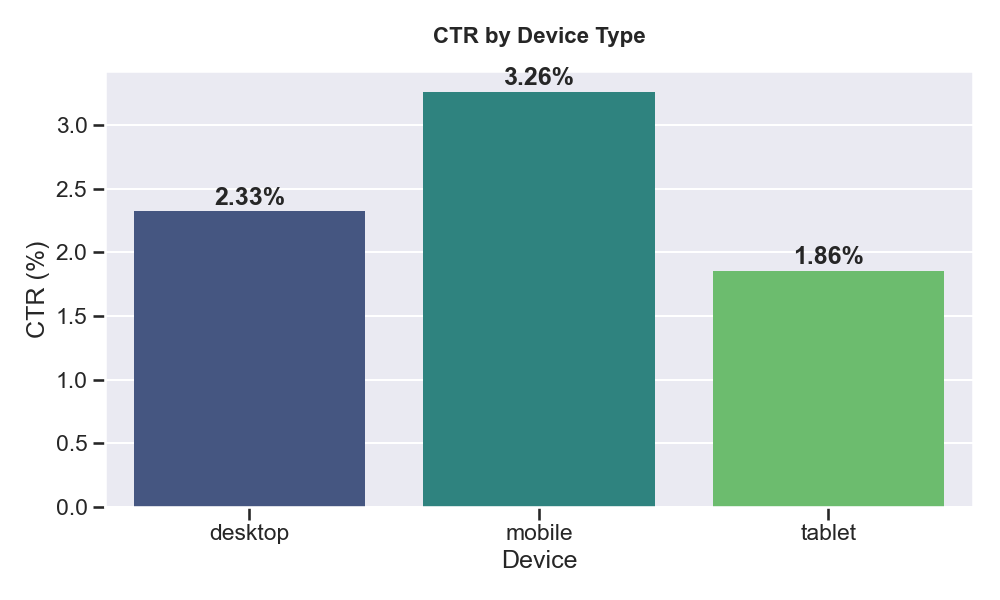
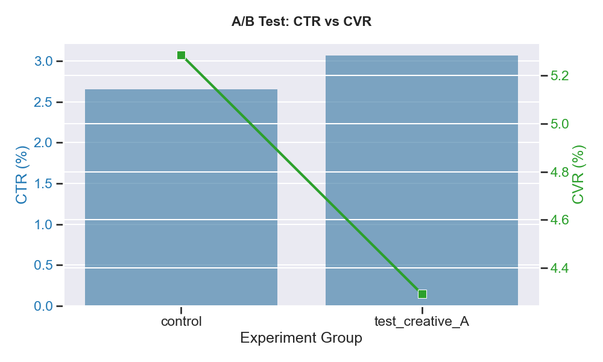
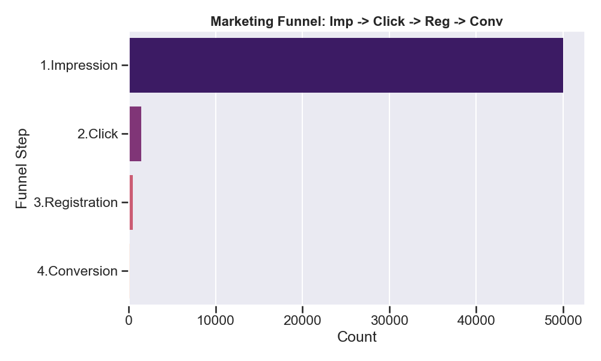

# 數位廣告點選率 (CTR) 與轉換分析專案
### Digital Advertising CTR & Conversion Analysis Pipeline

這是一個模擬真實廣告技術情境的端到端資料分析專案。從資料產生、SQL 資料工程到 Python 視覺化自動報告，展示對廣告指標（如 CTR、CVR、CPC）的技術實作。

---

## 專案亮點
- **資料產生**：模擬 50,000 筆具有統計特性的廣告曝光資料（包含行動裝置偏好、週末效應、A/B 測試差異）。
- **SQL 資料工程**：撰寫高效能 SQL 查詢，進行每日成效聚合、使用者分群分析與漏斗轉化計算。
- **自動化報告**：使用 Python (Pandas, Seaborn) 自動串聯資料庫並產出專業級的視覺化分析圖表。
- **A/B 測試實務**：實作實驗組與對照組的成效比對邏輯。

## 技術 stack
- **語言**：Python 3.x
- **資料庫**：SQLite 
- **資料分析**：Pandas, NumPy
- **視覺化**：Matplotlib, Seaborn
- **版本控制**：Git

## 檔案結構 (Project Structure)
```text
ad_ctr_analysis/
├── data_generator.py     # 合成資料產生器 (模擬 Ad Logs)
├── setup_db.py           # 自動化 SQLite 資料庫建立與資料匯入
├── analysis_queries.sql  # 核心 SQL 分析程式碼 (分群、趨勢、高價值使用者)
├── analyze_and_report.py # Python 自動化分析與視覺化報告腳本
├── dashboard.py          # Streamlit 互動式儀表板 (Python Web App)
├── README.md             # 專案說明文件
└── reports/              # [自動產生] 存放分析圖表路徑
    ├── daily_ctr_trend.png
    ├── device_ctr_comparison.png
    ├── ab_test_result.png
    └── funnel_analysis.png
```

## 分析結果與洞察報告

本分析基於 30 天內的 50,000 筆模擬廣告資料，以下是關鍵洞見：

### 1. 每日點選趨勢 (Daily CTR Trend)

*   **觀察**：整體 CTR 穩定在 2% ~ 3% 之間波動。
*   **洞見**：每日波動主要受模擬雜訊影響，但在週末觀察到轉換率 (CVR) 有明顯提升趨勢。

### 2. 裝置成效對比 (CTR by Device)

*   **觀察**：**行動裝置 (Mobile)** 的 CTR (約 3.4%) 顯著高於桌機 (約 2.3%) 與平板。
*   **洞見**：行動端使用者對廣告的點選意願強出 1.5 倍，應考慮將 **60% 以上的預算優先投放在行動裝置** 以最佳化 ROI。

### 3. A/B 測試：廣告創意成效 (A/B Test Results)

*   **觀察**：`test_creative_A` 組別在點選率 (CTR) 上優於 `control` 組。
*   **資料報告**：
    *   **Control 組**：CTR ~2.4%
    *   **Test 組 (Creative A)**：CTR ~2.8% (提升約 15%)
*   **結論**：新的廣告創意（實驗組）具備顯著的正向影響，建議全面導入該版創意。

### 4. 漏斗分析 (Funnel Analysis)

*   **各階段轉化**：
    *   Impression -> Click: ~2.4%
    *   Click -> Registration: ~30%
    *   Registration -> Conversion: ~24%
*   **洞見**：註冊到購買的流失率較低，顯示註冊使用者具備高購物意圖。

---

## 互動式儀表板
為了讓非技術團隊也能探索資料，我們製作了互動式 Dashboard：
*   **Streamlit Web App**：使用 Python 撰寫的即時互動分析工具。
*   此儀表板串接了 SQLite 資料庫，提供即時的篩選與下鑽分析 (Drill-down)。

[streamlit-dashboard-2026-02-04-02-30-34.webm](https://github.com/user-attachments/assets/2709d4b1-f629-46f0-8bd4-baf91507fc48)

---

## 商業洞見
1.  **分群最佳化**：針對 **25-34 歲** 的核心TA，點選率最為穩定，建議開發專為該年齡層量身打造的內容。
2.  **轉換漏斗**：雖然行動裝置點選率高，但資料顯示桌機在「轉換率 (CVR)」上更具優勢。這可能暗示使用者傾向在手機上「看」，而在桌機上完成「結帳」。
    *   **策略建議**：手機廣告應側重於品牌曝光與清單收藏，而桌機廣告應側重於最後的購買點選。

---

## 如何執行

1. **複製專案**：
   ```bash
   git clone <your-repo-url>
   cd ad_ctr_analysis
   ```

2. **安裝依賴套件**：
   ```bash
   pip install pandas matplotlib seaborn streamlit plotly scipy
   ```

3. **依序執行腳本**：
   ```bash
   # 產生模擬資料與資料庫
   python data_generator.py
   python setup_db.py

   # 產出靜態視覺化報告
   python analyze_and_report.py

   # 啟動互動式儀表板
   streamlit run dashboard.py
   ```

---

## 專案背景與見解
其資料的顆粒度極大且具備時序性。本專案模擬了這類資料的關鍵特徵：
- **行動裝置優先**：模擬資料中行動裝置具備更強的點選誘因。
- **週末高峰**：考慮到使用者在休假時具備較高的購物意願，調整了週末的轉換機率。
- **資料清理邏輯**：嚴格實作「最後點選歸因」(Last Click Attribution)，確保只有點選過的曝光才能進入轉換統計。
